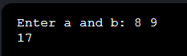

# Лабораторная работа № 2

## Тема
Указатели и динамическая память. Работа с указателями, динамическими массивами и матрицами.

**Студент:** Ерохина Анастасия Андреевна, ИВТ 1-1

---

## Задача 1: Сложение через указатели

### Постановка задачи
Получить значение переменных через указатели. Ввести два целых числа a и b. Сложить значения через указатели int *pa и int *pb и распечатать результат.

### Математическая модель
sum = *pa + *pb

### Список идентификаторов
| Имя | Тип | Описание |
|-----|-----|----------|
| a | int | Первое число |
| b | int | Второе число |
| pa | int* | Указатель на a |
| pb | int* | Указатель на b |
| sum | int | Результат сложения |

### Код программы
```c
#include <stdio.h>

int main(void) {
    int a, b;
    int *pa = &a;
    int *pb = &b;

    printf("Enter a and b: ");
    scanf("%d %d", &a, &b);

    int sum = *pa + *pb;
    printf("%d\n", sum);

    return 0;
}
```

### Результаты выполненной работы



```
Enter a and b: 8 9
17
```

---

## Задача 2: Обмен двух чисел

### Постановка задачи
Изменить данные по адресу (swap). Ввести два целых числа a и b. Вывести сначала исходные значения, затем обменённые. Обмен выполнять через указатели.

### Математическая модель
temp = *pa, *pa = *pb, *pb = temp

### Список идентификаторов
| Имя | Тип | Описание |
|-----|-----|----------|
| a | int | Первое число |
| b | int | Второе число |
| pa | int* | Указатель на a |
| pb | int* | Указатель на b |
| temp | int | Временная переменная для обмена |

### Код программы
```c
#include <stdio.h>

int main(void) {
    int a, b;
    int *pa = &a;
    int *pb = &b;

    printf("Enter a and b: ");
    scanf("%d %d", &a, &b);

    printf("%d %d\n", *pa, *pb);

    int temp = *pa;
    *pa = *pb;
    *pb = temp;

    printf("%d %d\n", *pa, *pb);

    return 0;
}
```

### Результаты выполненной работы


```
Enter a and b: 3 7
3 7
7 3
```


---

## Задача 3: Максимум через указател 

### Постановка задачи
Сравнить значения двух целых чисел через указатели и вывести максимальное из них.

### Математическая модель
max = (*pa > *pb) ? *pa : *pb

### Список идентификаторов
| Имя | Тип | Описание |
|-----|-----|----------|
| a | int | Первое число |
| b | int | Второе число |
| pa | int* | Указатель на a |
| pb | int* | Указатель на b |
| max | int | Максимальное значение |

### Код программы
```c
#include <stdio.h>

int main(void) {
    int a, b;
    int *pa = &a;
    int *pb = &b;

    printf("Enter a and b: ");
    scanf("%d %d", &a, &b);

    int max = (*pa > *pb) ? *pa : *pb;
    printf("%d\n", max);

    return 0;
}
```

### Результаты выполненной работы


```
Enter a and b: 11 4
11
```


---

## Задача 4: Динамический массив и сумма 

### Постановка задачи
Выделить память под динамический массив с помощью malloc. Ввести число n и n целых чисел. Вычислить сумму всех элементов. Обход элементов выполнять через арифметику указателей.

### Математическая модель
sum = Σ(arr[i]), обход через указатель ptr + i

### Список идентификаторов
| Имя | Тип | Описание |
|-----|-----|----------|
| n | int | Количество элементов |
| arr | int* | Указатель на динамический массив |
| ptr | int* | Указатель для обхода массива |
| sum | int | Сумма элементов |
| i | int | Счетчик цикла |

### Код программы
```c
#include <stdio.h>
#include <stdlib.h>

int main(void) {
    int n;

    printf("Enter n: ");
    scanf("%d", &n);

    int *arr = (int *)malloc((size_t)n * sizeof(int));
    if (arr == NULL) {
        printf("Memory allocation failed\n");
        return 1;
    }

    int *ptr = arr;
    for (int i = 0; i < n; i++) {
        scanf("%d", ptr + i);
    }

    int sum = 0;
    for (int i = 0; i < n; i++) {
        sum += *(ptr + i);
    }

    printf("%d\n", sum);

    free(arr);
    return 0;
}
```

### Результаты выполненной работы


```
Enter n: 4
2 3 4 5
14
```

---

## Задача 5: Обратный вывод динамического массива 

### Постановка задачи
Ввести число n и n целых чисел. Вывести элементы в обратном порядке. Использовать указатель и операцию декремента (--).

### Математическая модель
ptr = arr + n - 1, затем последовательно выводить *ptr и выполнять ptr--

### Список идентификаторов
| Имя | Тип | Описание |
|-----|-----|----------|
| n | int | Количество элементов |
| arr | int* | Указатель на динамический массив |
| ptr | int* | Указатель для обхода с конца |
| i | int | Счетчик цикла |

### Код программы
```c
#include <stdio.h>
#include <stdlib.h>

int main(void) {
    int n;

    printf("Enter n: ");
    scanf("%d", &n);

    int *arr = (int *)malloc((size_t)n * sizeof(int));
    if (arr == NULL) {
        printf("Memory allocation failed\n");
        return 1;
    }

    for (int i = 0; i < n; i++) {
        scanf("%d", arr + i);
    }

    int *ptr = arr + n - 1;
    for (int i = 0; i < n; i++) {
        printf("%d ", *ptr);
        ptr--;
    }
    printf("\n");

    free(arr);
    return 0;
}
```

### Результаты выполненной работы


```
Enter n: 3
10 20 30
30 20 10
```


---

## Задача 6: Побайтовый вывод int 

### Постановка задачи
Понять, как данные хранятся в памяти. Дана переменная int a = 1234567890. Вывести значения байтов переменной в десятичном виде. Использовать указатель unsigned char *.

### Математическая модель
Каждый байт переменной интерпретируется как unsigned char и выводится его числовое значение (0-255).

### Список идентификаторов
| Имя | Тип | Описание |
|-----|-----|----------|
| a | int | Исходная переменная |
| p | unsigned char* | Указатель на побайтовый доступ |
| i | int | Счетчик цикла |

### Код программы
```c
#include <stdio.h>

int main(void) {
    int a = 1234567890;
    unsigned char *p = (unsigned char *)&a;

    for (int i = 0; i < sizeof(int); i++) {
        printf("%d ", p[i]);
    }
    printf("\n");

    return 0;
}
```

### Результаты выполненной работы


```
210 43 205 73
```

**Результат задачи 6**

---

## Задача 7: Динамическая матрица 2x3

### Постановка задачи
Выделить память для двумерного динамического массива как массив указателей на строки. Ввести 6 целых чисел для матрицы 2×3. Вывести матрицу построчно. Корректно освободить память.

### Математическая модель
Матрица A[2][3], ввод элементов A[i][j], вывод в том же порядке.

### Список идентификаторов
| Имя | Тип | Описание |
|-----|-----|----------|
| rows | int | Количество строк (2) |
| cols | int | Количество столбцов (3) |
| m | int** | Указатель на массив указателей на строки |
| i, j | int | Счетчики циклов |

### Код программы
```c
#include <stdio.h>
#include <stdlib.h>

int main(void) {
    int rows = 2;
    int cols = 3;
    int i, j;

    int **m = (int **)malloc((size_t)rows * sizeof(int *));
    if (m == NULL) {
        printf("Memory allocation failed\n");
        return 1;
    }

    for (i = 0; i < rows; i++) {
        m[i] = (int *)malloc((size_t)cols * sizeof(int));
        if (m[i] == NULL) {
            printf("Memory allocation failed\n");
            for (j = 0; j < i; j++) {
                free(m[j]);
            }
            free(m);
            return 1;
        }
    }

    for (i = 0; i < rows; i++) {
        for (j = 0; j < cols; j++) {
            scanf("%d", &m[i][j]);
        }
    }

    for (i = 0; i < rows; i++) {
        for (j = 0; j < cols; j++) {
            printf("%d ", m[i][j]);
        }
        printf("\n");
    }

    for (i = 0; i < rows; i++) {
        free(m[i]);
    }
    free(m);

    return 0;
}
```

### Результаты выполненной работы


```
1 2 3 4 5 6
1 2 3
4 5 6
```


---

**Информация о студенте**  
Ерохина Анастасия Андреевна, ИВТ 1-1
```
